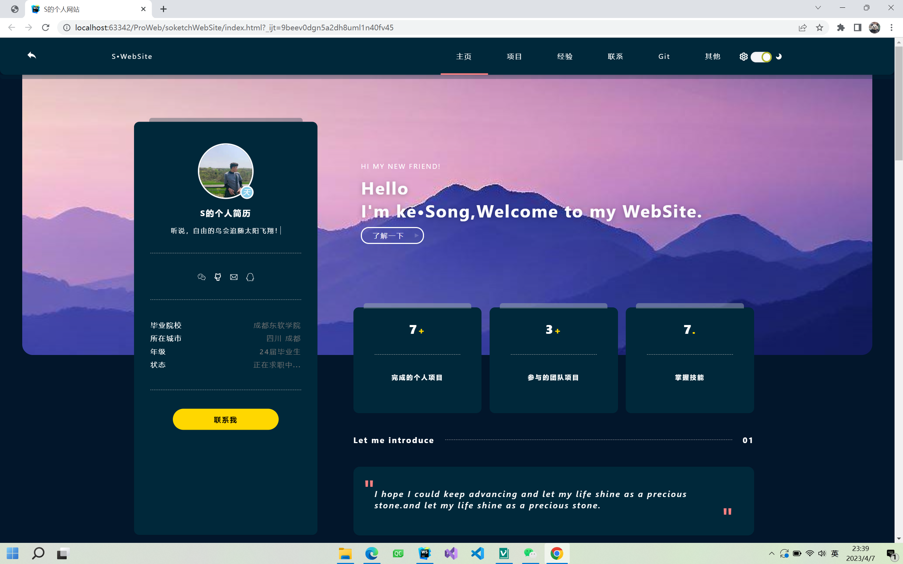

### hello,这是一个网站介绍.
<center>网站界面</center>


主要采用HTML/CSS/JS实现，用到了轮播图，动画，反转等css效果以及js捕获事件。
下面介绍几个重点实现效果
1. 开关灯效果
主要原理是通过 按键 修改页面背景颜色属性完成

html代码块：
```html
    <span class="kaig-bottm">     
        <svg></svg>
        <span class="my-radio active" id="myRadio">
                <i></i>
           </span>
    </span>
```
开关灯 CSS代码：
```css
.kaig-bottm img {
  width: 15px;
  height: 15px;
}
.kaig-bottm .my-radio{
  position: relative;
  display: inline-block;
  height: 20px;
  width: 40px;
  vertical-align: middle;
  background: #F4F5F7;
  border-radius: 2em;
  box-shadow: inset 0 0 4px -1px rgb(0 0 0 / 15%);
  transition: .4s ease-in-out;
  cursor: pointer;
}
```
反差效果：
```css
.kaig-bottm .my-radio.active>i{
  right: 0px;
  left: auto;
}
.kaig-bottm .my-radio>i{
  position: absolute;
  left: 0px;
  top: 0px;
  bottom: 0px;
  display: inline-block;
  width: 35%;
  border: solid 3px #AFB42B;
  border-radius: 50%;
  background: #FCFCFE;
  transition: all .2s ease;
}
```

2. 按键动画效果：
    核心就是使用animation属性并设置为 infinite 循环。


                  <center>button的演示效果</center>
                  
 CSS代码块：
```CSS
.button{
  display: block;
  margin: 0 auto;
  border: none;
  height: 40px;
  line-height: 40px;
  width: 200px;
  font-weight: 600;
  color: #000;
  border-radius: 50px;
  background: linear-gradient(-45deg, #ffd700 50%, #fff 60%, #ffd700 70%); 
  background-size: 600% 100%;
  animation: shine 5s infinite;
}
```

3. 轮播图效果展示


有两种实现方法
第一种是采用ul>li再使用css的float实现效果。
第二种是采用div或者span等，再用css的display转化为行内块inline-block实现效果。
这里就只介绍第二种
css样式：
```css
.div calss {
  display: inline-block;
  height: 300px;
  box-sizing: border-box;
  width: 680px;
  text-align: center;
  padding: 50px 20px;
}
```
4.卡片阴影效果采用box-shadow实现。

5.图片的缩放效果 

6.图层hover，这个简单不作演示


    
 
    


    
